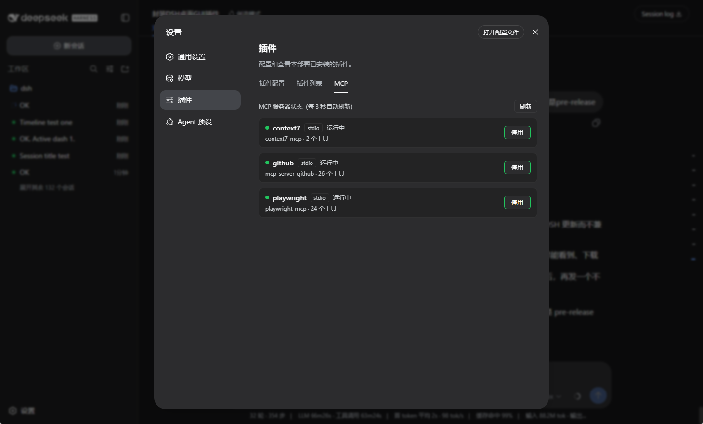

# dsh-mcp-panel

给 DeepSeek Harness（DSH）加一个 **MCP 管理面板**：在 Web GUI 的 **设置 → 插件** 里新增一个 **MCP** 标签页，查看已安装 MCP 服务器的运行状态、工具数量，并一键启用或停用。

## 预览



## 功能

- 列出 cordis 配置中所有 `@deepseek-ai/dsh-mcp-client` 行（stdio / streamable-http 两种传输）
- 显示每个 MCP 服务器：服务器名、传输类型、启动命令 / URL、运行状态（运行中 / 已停止 / 加载失败）、已同步工具数
- 一键「停用 / 启用」：停用断开 MCP 进程并注销全部工具；启用重新拉起进程、连接并同步工具
- 每 3 秒自动刷新状态，支持手动刷新

## 怎么安装（手动安装）

### 你需要先有

- 电脑上已经能用的 DSH（终端里 `dsh` 命令能跑）

### 两步装好

**第 1 步**：到本仓库的 Release 页面下载 `dsh-mcp-panel-0.1.1.tgz`，然后在终端执行：

```sh
dsh plugin --profile web add ./dsh-mcp-panel-0.1.1.tgz
```

**第 2 步**：重启 DSH Web 服务（先停止当前的 `dsh web`，再重新启动）。

打开 **设置 → 插件 → MCP** 即可使用。安装后，在 **设置 → 插件 → 插件列表** 中会显示为 **`dsh-mcp-panel`**。

### 从 GitHub 直接安装（不下载文件）

```sh
dsh plugin --profile web add github:SuperPaiGu/dsh-mcp-panel
```

装完同样需要重启 DSH Web 服务。

### 卸载

```sh
dsh plugin --profile web remove dsh-mcp-panel
```

## 注意事项

- **生效范围**：停用某个 MCP 后，其全部工具（如 `mcp__github__*`）立即从当前会话注销
- **默认恢复**：启用 / 停用只影响当前运行；DSH 重启后所有 MCP 回到配置文件中的默认状态

## 目录结构

```
dsh-mcp-panel/          组合包根
├── package.json        dsh.bundle + dsh.client 声明
├── cordis.patch.yml    插件层（id mcp-panel → dsh-mcp-panel）
├── index.js            Host 插件：/mcp-panel/* 端点 + loader 枚举/启停
├── client.js           Web 客户端 bundle：设置面板 MCP 标签页
└── README.md
```

## License

MIT
